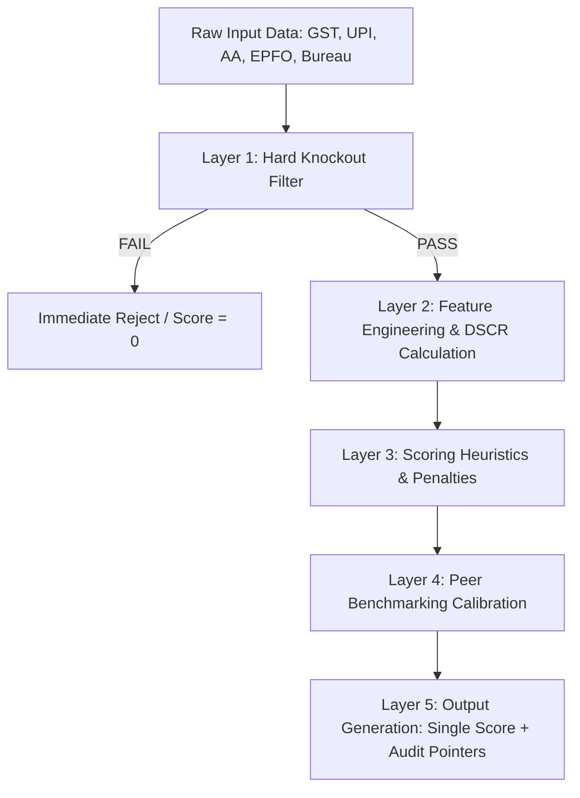

# Business Requirement Document (BRD)
## Project: MSME Pulse Financial Health Card & Credit Scoring Engine (V2.0)

---

## 1. Document Overview
This document outlines the business and technical requirements to upgrade the credit underwriting logic of the MSME Pulse Scoring Engine. 

### Core Product Philosophy
* **Unified Score**: The system will produce a single, cohesive **Financial Health Score (0-100)**. We reject showing multiple independent scores, which causes decision fatigue for credit officers.
* **Under the Hood Complexity**: The single score must mathematically integrate advanced risk vectors (Debt Serviceability, Transactional Hygiene, Tax Reconciliation, and Peer Benchmarking).
* **Hard Knockouts**: The engine will enforce automated reject rules that immediately fail an application regardless of the raw score.
* **Auditability**: Every component contributing to the final score must output a detailed, human-readable "Audit Pointer" list, providing the bank's credit committee and RBI auditors with transparent evidence.

---

## 2. Updated Scoring Architecture & Pipeline
The scoring pipeline must process raw data through five sequential layers:



---

## 3. Detailed Functional Requirements

### 3.1. Layer 1: Hard Knockout (Go/No-Go) Criteria
Before any scoring logic runs, the payload must pass the Knockout Filter. If any knockout condition is met:
1. The scoring engine immediately short-circuits.
2. The `overall_score` is set to `0`.
3. The `risk_category` is set to `REJECTED`.
4. A specific knockout reason is added to the audit pointers.

| Trigger Parameter | Knockout Condition | Data Source | Reject Reason Text |
| :--- | :--- | :--- | :--- |
| **Bureau Score** | CIBIL Score < 680 | Bureau API / Input | "Promoter CIBIL score is below bank threshold (680)." |
| **Leverage Ratio** | Debt-to-Income (DTI) > 50% | AA (EMI / Credits) | "Leverage exceeds maximum permissible limits (DTI > 50%)." |
| **Transaction Hygiene** | >2 Cheque/Debit Bounces in last 3 months | AA Bank Statements | "Excessive cheque/ECS bounces detected in bank statement." |
| **Tax Default** | GST GSTR-3B filing delay > 60 days | GST Logs | "Severe GST tax filing delay (> 60 days overdue)." |

---

### 3.2. Layer 2: Debt Serviceability & DSCR-Based Eligibility
Instead of calculating credit limits as a naive multiplier of sales, the engine must model cash flow viability.

1. **Operating Margin Estimation**:
   * Estimate Net Cash Margin ($NCM$) using GST Sales and Purchase data:
     $$NCM = \frac{\text{Total GST Sales} - \text{Total GST Purchases}}{\text{Total GST Sales}}$$
   * Cap $NCM$ between a minimum of $5\%$ and maximum of $25\%$ to account for operating costs not reflected in GST.
2. **Free Monthly Cash Flow ($FMCF$)**:
   * Calculate average monthly sales ($AMS$) from GST.
   * Calculate $FMCF$ as:
     $$FMCF = (AMS \times NCM) - \text{Existing EMIs (from AA)}$$
3. **Debt Service Coverage Ratio (DSCR)**:
   * Calculate proposed loan EMI ($ProposedEMI$) for requested amount (default to a standard 24-month term at $14\%$ interest if not specified).
   * Calculate DSCR:
     $$DSCR = \frac{FMCF + \text{Existing EMIs}}{ProposedEMI + \text{Existing EMIs}}$$
4. **Eligibility Adjustments**:
   * If calculated $DSCR < 1.25$, the recommended loan amount must scale down dynamically until $DSCR \ge 1.25$ is satisfied.
   * If no loan amount satisfies a $DSCR$ of $1.25$ (e.g. existing EMIs already consume all free cash flow), the loan eligibility is set to **₹0.00**.

---

### 3.3. Layer 3: Transactional Hygiene & Cheque Bounce Analyzer
Cheque bounces and payment failures are direct indicators of liquidity stress and poor credit character.

1. **Bounce Frequency Metric**:
   * Parse transactional logs from Account Aggregator (AA) data.
   * Identify debits with return codes (e.g., *Insufficient Funds*, *ECS Return*, *Bounce*).
2. **Score Deduction Logic**:
   * Bounces are evaluated over a rolling 3-month window.
   * **0 Bounces**: No penalty.
   * **1 Bounce**: Deduct $10$ points from the *Cash Flow & Stability Score*.
   * **2 Bounces**: Deduct $25$ points from the *Cash Flow & Stability Score*.
   * **>2 Bounces**: Triggers Hard Knockout (Score = 0).

---

### 3.4. Layer 4: GST Reconciliation Engine (Sales vs Taxes Paid)
Detect potential shell companies or tax evasions by reconciling sales reported with tax payments.

1. **GST Filing Consistency**:
   * Match sales declared in **GSTR-1** (supply returns) with liabilities settled in **GSTR-3B** (payment returns).
   * Calculate the **GST Compliance Ratio**:
     $$\text{GST Compliance Ratio} = \frac{\text{Sales Settled in GSTR-3B}}{\text{Sales Declared in GSTR-1}}$$
2. **Score Adjustment**:
   * Ratio $\ge 0.95$: No penalty (Fully Reconciled).
   * Ratio between $0.85$ and $0.94$: Deduct $10$ points from *Compliance Score*.
   * Ratio $< 0.85$: Deduct $30$ points from *Compliance Score* and generate a warning flag in the Audit Trail indicating potential invoice inflation.

---

### 3.5. Layer 5: Peer Benchmarking Calibration
Contextualize the MSME's growth based on its sector (NIC code) and geographic state.

1. **Growth Deflator/Inflator**:
   * The model compares the company's GST Revenue Growth against the Industry Average Growth rate ($I_g$) for that sector.
   * Let Relative Growth ($RG$) = $\text{Company Revenue Growth} - I_g$.
   * Adjust the *Growth Score* component:
     * If $RG > 10\%$: Add $+5$ points bonus (capped at 100).
     * If $RG < -10\%$: Deduct $-10$ points penalty.

---

## 4. Single Unified Score Formulation
The final overall credit score (0-100) is calculated as:

$$\text{Overall Score} = w_1 \times \text{Revenue Score} + w_2 \times \text{Cash Flow Score} + w_3 \times \text{Compliance Score} + w_4 \times \text{Stability Score}$$

Where:
* **Weights**: Revenue ($25\%$), Cash Flow & Hygiene ($30\%$), Tax Compliance ($25\%$), and Stability & Benchmarking ($20\%$).
* **Knockout Override**: If any knockout condition is met, $\text{Overall Score} = 0$.

---

## 5. Audit Pointers (Backend Response Contract)
For every credit score calculated, the API response must include an `audit_trail` dictionary containing verifiable facts. This acts as the evidence ledger for credit committees and auditors.

```json
{
  "overall_score": 74,
  "risk_category": "Medium",
  "audit_trail": {
    "knockout_checks": [
      { "check_name": "CIBIL Threshold", "status": "PASS", "value": "710 (Limit: 680)" },
      { "check_name": "Debt-to-Income", "status": "PASS", "value": "24% (Limit: 50%)" },
      { "check_name": "Cheque Bounces", "status": "PASS", "value": "1 bounce (Limit: <=2)" }
    ],
    "financial_evidence": {
      "estimated_operating_margin": "14.2%",
      "debt_service_coverage_ratio": "1.38x (Proposed loan of ₹15,00,000 is viable)",
      "gst_reconciliation_variance": "98.1% match between GSTR-1 and GSTR-3B",
      "peer_comparison": "Outperforming Food Processing sector average growth by +4.2%"
    },
    "score_deductions": [
      { "component": "Cash Flow Score", "deduction": -10, "reason": "1 automated debit bounce detected in May 2026" }
    ]
  }
}
```
